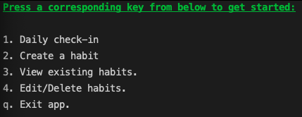
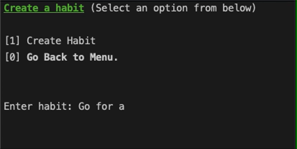
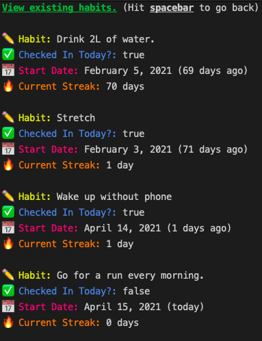
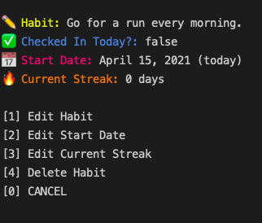
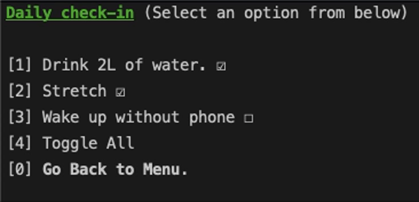

# HabitTracker

#### Description:
A node.js CRUD app built for the command-line that allows users to create, view, and edit their own habits. Most notably, the app comes with a daily check-in feature that allows users to maintain daily accountability for their habits.
* Gathering user input from the keyboard was done through the use of [readline-sync](https://www.npmjs.com/package/readline-sync)
* User data is stored locally through [MongoDB](https://www.mongodb.com/)
* Interaction between the database and JavaScript was facilitated through [Mongoose](https://mongoosejs.com/)

#### Main Menu:
Users can select from 5 options to carry out CRUD operations.

#### Create a habit:
Users can create a habit that will store the habit's name, check in status, start date, and current streak.

#### View habits:
Users can view all of the relevant data for each habit in an aesthetic psuedo-GUI.

#### Edit habits:
Users can edit the habit name, start date, and current streak.

#### Check-in:
Users can check in for the day, toggling each habit individually or by using the toggle-all feature. Checking in will automatically update the database's current values for current streak and check in status.

